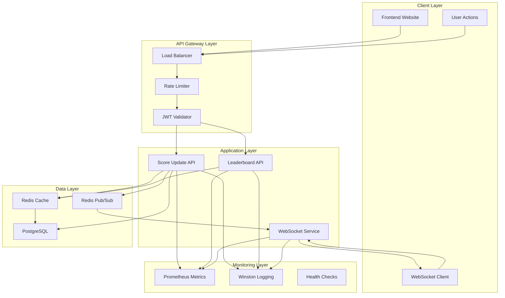
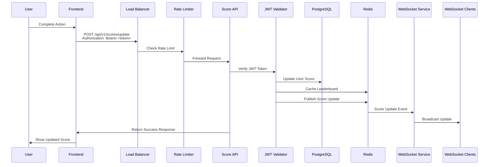
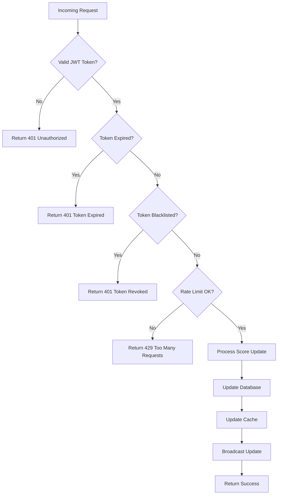
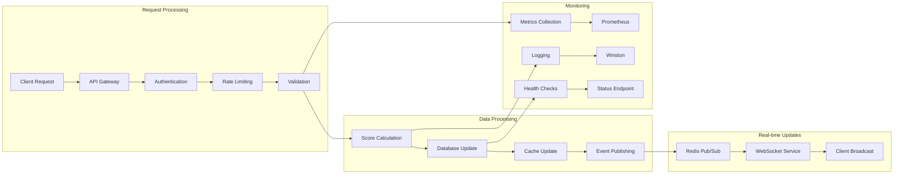
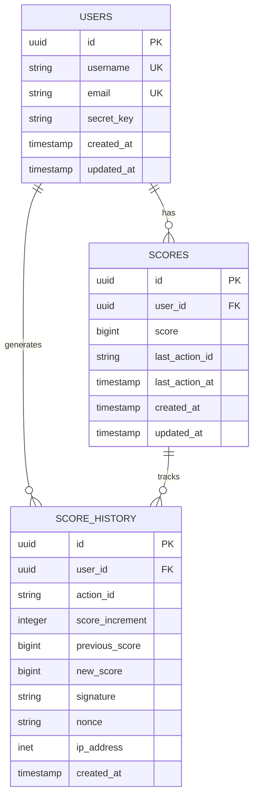
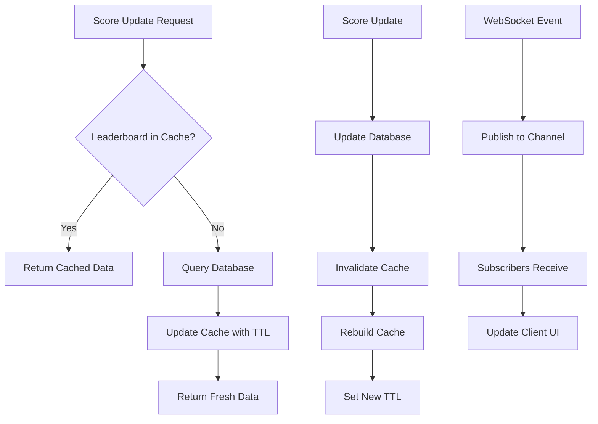
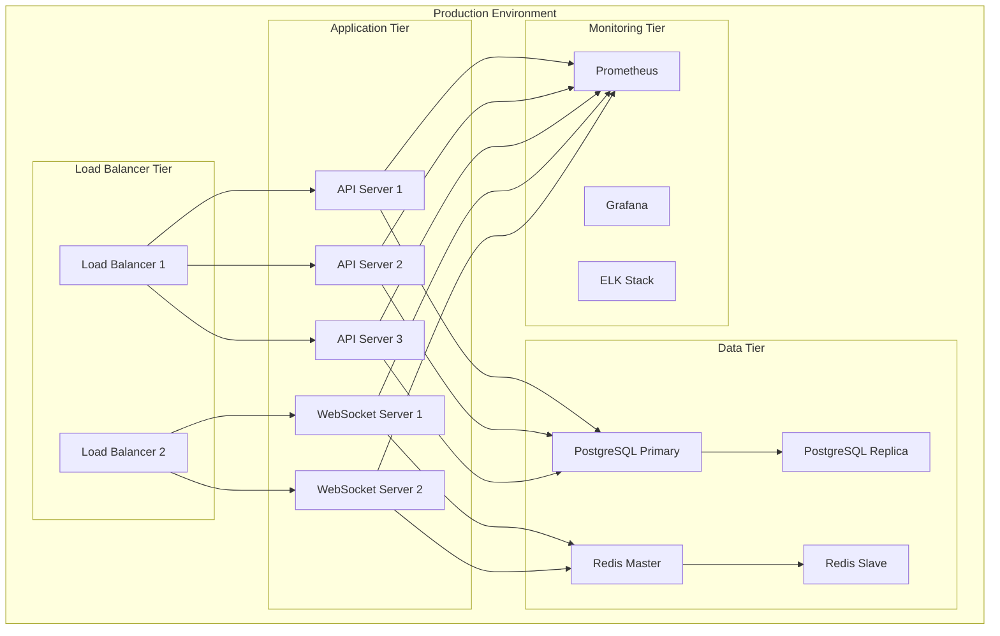
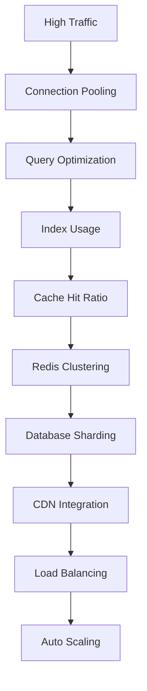
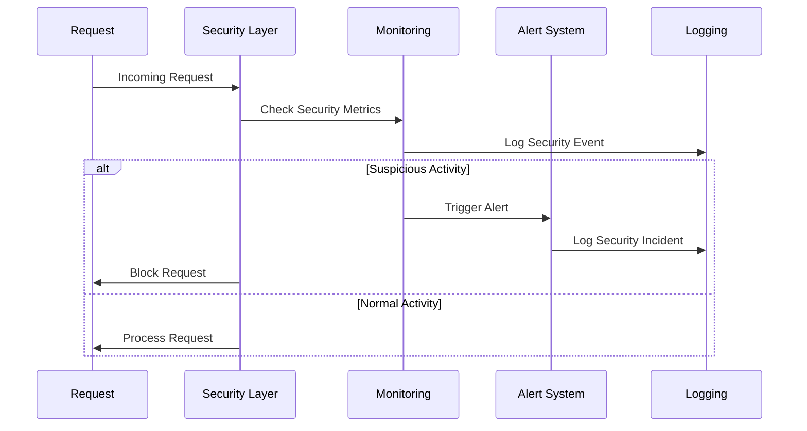

# Scoreboard API Service - Architecture Diagram

## System Overview

## Score Update Flow

## Security Validation Flow

## Data Flow Architecture

## Database Schema Relationships

## Redis Caching Strategy

## Deployment Architecture

## Performance Optimization Flow

## Security Monitoring Flow

---

## Key Design Principles

1. **Security First**: Multiple layers of validation and authentication
2. **Performance**: Caching and optimization at every layer
3. **Scalability**: Horizontal scaling with load balancing
4. **Reliability**: High availability with redundancy
5. **Monitoring**: Comprehensive observability and alerting
6. **Real-time**: WebSocket integration for live updates
7. **Data Integrity**: ACID transactions and audit trails
